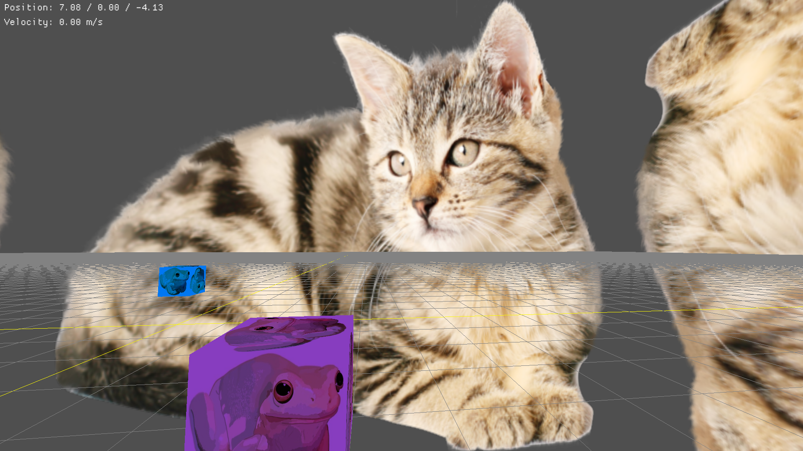

# test-games

2 "games" i developed to learn more about gamedev

## 3d

`cargo run --bin 3d`

solve the puzzle and be rewarded! you can also die

### controls

| effect | input      |
| ------ | ---------- |
| move   | W, A, S, D |
| sprint | Shift      |
| jump   | Space      |
| look   | Mouse      |
| zoom   | Q, E       |
| stats  | Tab        |

and a secret ability... can you find it?

## 2d

`cargo run --bin 2d`

i don't really know what this is tbh

### controls

| effect | input      |
| ------ | ---------- |
| move   | W, A, S, D |
| invert | Space      |

## License

Subject to the MIT license. See `LICENSE.txt` for more information.

All files within the `assets/` directory are in the public domain.
